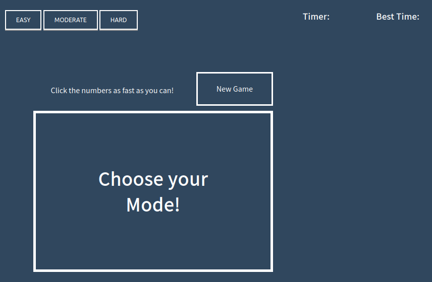
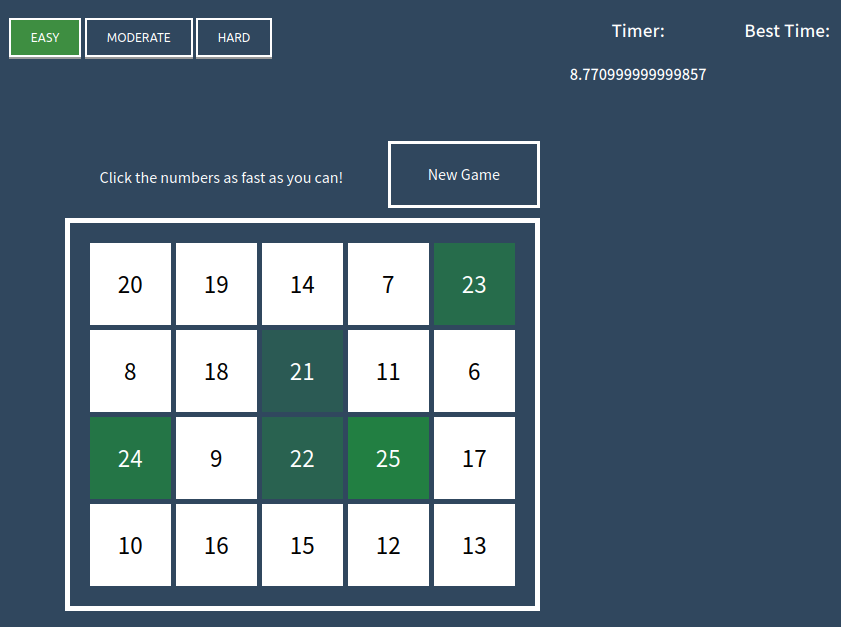

## Game using HTML, CSS and Javascript

The game consists of 3 files and 1 folder:
- index.html (The landing page for the webpage/game)
- game.js (The javascript file used for this game. It is responisble for the the shuffled numbers in thje grid, timers and noting the best scores and many more)
- styles.css (The CSS file responsible for the styling of the webpage. Without it the game does not look like a game)
- sound (This folder has the collection of sounds used in the game)

### Preview of the game

